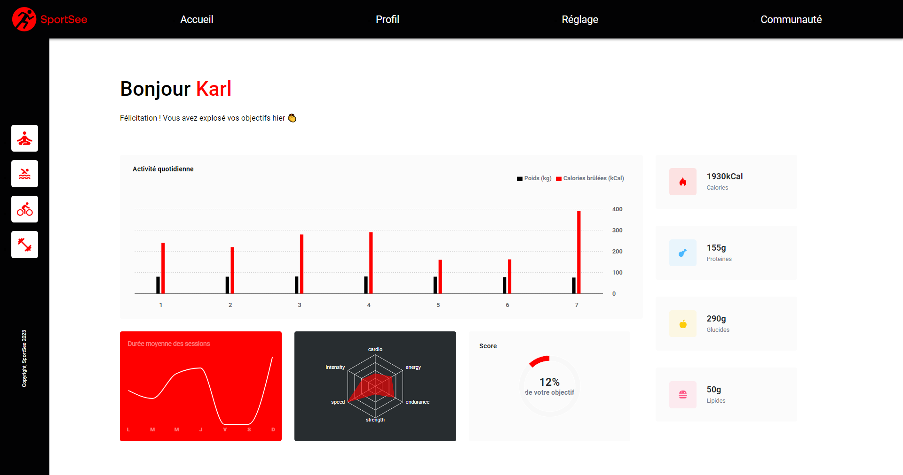

## Développez un tableau de bord d'analytics avec React - SportSee

### P12 - OpenClassrooms "Développeur Concepteur Logiciel"

#### Contexte du projet

Vous travaillez en tant que développeur chez SportSee, une startup dédiée au coaching sportif. En pleine croissance, l’entreprise va aujourd’hui lancer une nouvelle version de la page profil de l’utilisateur. Cette page va notamment permettre à l’utilisateur de suivre le nombre de sessions réalisées ainsi que le nombre de calories brûlées.

Vous recevez ce matin un Slack de Charles, le Product Owner :

> Hello ! Bon, c’est le grand jour aujourd’hui, on va s’attaquer à la nouvelle page profil utilisateur du site. Tiens, Léo (le designer) vient de me faire parvenir le [lien de la maquette](./src/assets/Maquette%20SportSee.pdf). Et voici [le kanban](https://alex-pqn.notion.site/Tableau-de-bord-SportSee-99f962746cae4bf7aa9fe0e436f2a220?pvs=4) avec les User Stories à intégrer pour ce projet. Pour ce sprint, il faut que tu intègres les US de la partie TODO (le reste sera au sprint suivant).

Puis par la suite, Antoine, le Lead Developer, vous communique les précisions techniques sur la page profil :

> L’objectif est de refaire la page profil avec React. Tu seras en charge de développer la page. Comme tu as pu le constater, le projet intègre des graphiques sur l’activité sportive de l’utilisateur. Je t’invite à utiliser soit D3, soit Recharts. <br/> Concernant les données, je t’ai créé [un backend](https://github.com/Alex-Pqn/SportSee-backend-ocr_dcl) utilisant NodeJS que tu peux trouver ici. Il va te permettre de réaliser tes calls HTTP et de récupérer des données d’exemple, tout y est décrit. Pour la gestion des calls en eux-mêmes, je t’invite à utiliser soit Fetch, soit Axios. Par contre, il est important que tu réalises les calls en dehors des composants React, dans un service par exemple. <br/> D’ailleurs, il faudra que tu commences le projet en réalisant un mock des données de l'API. Dès que ton projet sera fonctionnel, tu pourras t’attaquer à l’intégration de l’API. Il faudra également que tu crées une classe de modélisation des données pour t'assurer de toujours formater correctement les données de l'API avant de les utiliser.

Après avoir fait le point avec Charles et Antoine, vous décidez d'attaquer le projet..

#### Objectifs

- Site web créé sous React 18.2 et React Router 6.4
- Utilisation de composants réutilisables et validation des données grâce aux props React
- Communication avec une API REST existante
- Utilisation d'un service et de requêtes GET afin de récupérer les données de l'API
- Création de chartes graphiques dynamiques avec la librairie `recharts`, en passant les données récupérées depuis l'API dans les chartes
- Mise en place de mocks pour le développement et les tests
- Architecture des dossiers et fichiers respectée
- Utilisation de Sass et de la méthodologie BEM
- Documentation du projet avec de la JSDocs

## Prerequisites

- You will need to have Node and `npm` installed locally on your machine.
- The [backend part](https://github.com/Alex-Pqn/SportSee-backend-ocr_dcl) that contains all the source code to run the micro API for the SportSee dashboard. The backend is not mandatory for testing the app, as integrated mocks are present by default in this project.

> [!WARNING]  
> The default environment is the development environment, so it uses built-in mocks. If you want to use the API below and link it to the dashboard, go to the [src/config/api/api.config.js](./src/config/api/api.config.js) file and change `Environments.development` to `Environments.production` on line 7.

## Project setup

### Install

```
npm install
```

### Compiles and hot-reloads for development

Runs the app in the development mode.
Open [http://localhost:3001](http://localhost:3001) to view it in your browser.

```
npm run start
```

### Running tests

```
npm run test
```

### Compiles and minifies for production

```
npm run build
```

## Preview


